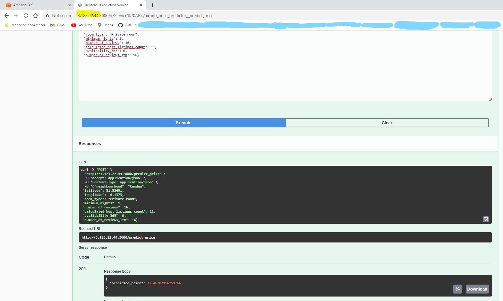
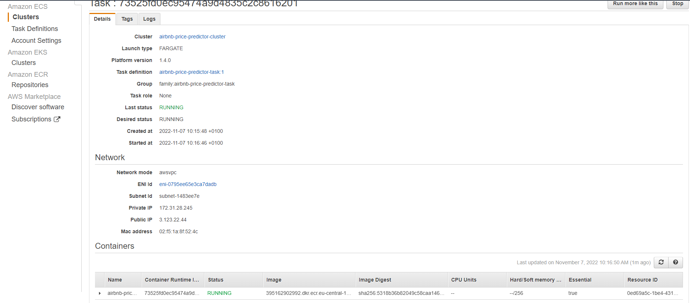

# airbnb
## Goal
In this project I built and deployed a model for predicting airbnb room prices based on several parameters. This model can be used for suggesting the price to someone offering accomodation in airbnb 

## Tasks
- Data preparation
- EDA
- Trained several models: linear, decision tree, random forest and XGboost
- Served the best model (XGBoost) with BentoML and tested it with swagger UI
- Deployed the model locally with bentoml / docker
- deployed the model to AWS with ECR / ECS

## Usage
- Clone the repository, cd to the airbnb repo folder
- run pip install -r requirements.txt
- Run train.py 
- run bentoml serve predict.py:svc 
- Open the link http://0.0.0.0:3000. If you are using windows open http://localhost:3000 to test the model with swagger UI
- Enter JSON input data in the following format. Here are alternative categories for neighbourhood and room_type:
neighbourhood : City of London, Kensington and Chelsea, Westminster, Islington, Wandsworth / 
room_type: Hotel room, Entire home/apt	, Private room	, Shared room
{"neighbourhood": "Camden",
 "latitude": 51.52691,
 "longitude": -0.1373,
 "room_type": "Private room",
 "minimum_nights": 1,
 "number_of_reviews": 16,
 "calculated_host_listings_count": 11,
 "availability_365": 0,
 "number_of_reviews_ltm": 16}
- Run the containerized prediction job with the following commands (you need docker installed on your machine)
    * bentoml build
    * bentoml containerize airbnb_price_predictor:latest
    * fetch the actual tag from terminal output and run : docker run -it --rm -p 3000:3000 airbnb_price_predictor:2c7ncjc52suw3igt serve --production
    * Open the link http://0.0.0.0:3000. If you are using windows open http://localhost:3000 to test the model with swagger UI and test data in the same way you did it previously

## Cloud Deployment 

Here you can see how I am using the prediction service in the cloud. For this I pushed the docker image to AWS ECR and ran the prediction taks in ECS

